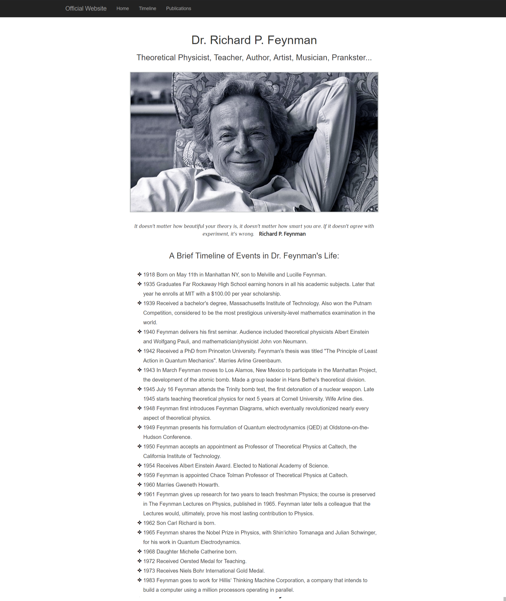
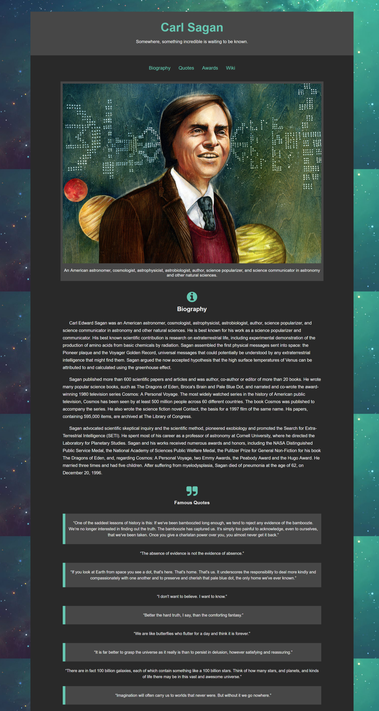

## Stan Lee - Tribute Page

Work together and create a tribute page for the comic book legend Stan Lee. This is a basic frontend design project and you can use HTML, CSS, JS, Sass, etc. 

### The site must have the following content

* Heading 
* Image of Stan Lee
* His Biography in the form of a paragraph
* Achievements
* His Famous Quotes
* Info on Characters created by him
* About Spiderman

### Some sample Tribute pages are given below:

* Dr. Richard Feynman Tribute

* Carl Sagan Tribute

